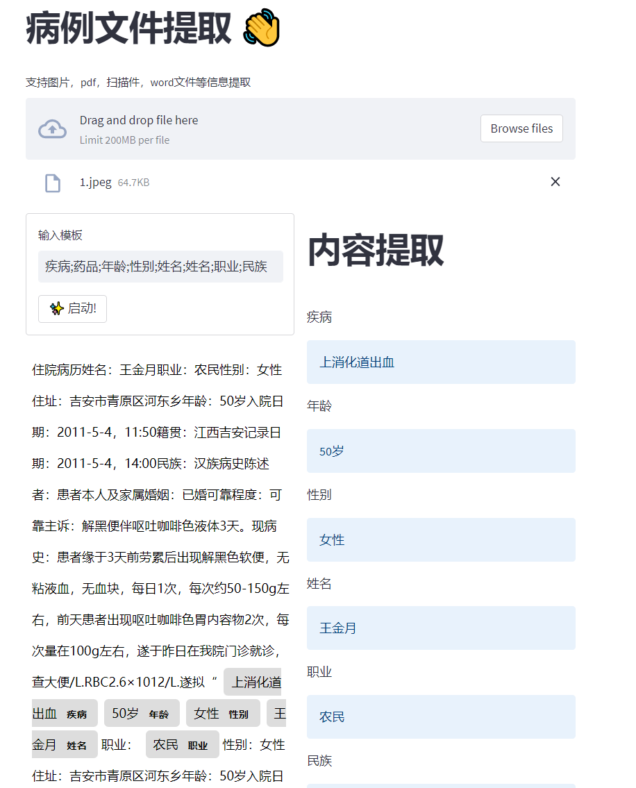

## 病历文件信息抽取
### 背景
该项目是为了解决医疗行业中的病历文件信息抽取问题，主要包括病历文件的解析和信息抽取两个部分。


### 数据形式


### 代码结构

```
├── AI-病历文件提取.py     # 前端展示
├── file_parsing.py       # 文件解析
├── tempDir               # 暂存文件夹
├── static
│   ├── ocr_files         # 保存上传的文件
```


### 项目启动

```
streamlit run  AI-病历文件提取.py
```


### 前端展示
* 前端展示地址：http://ip:8501



